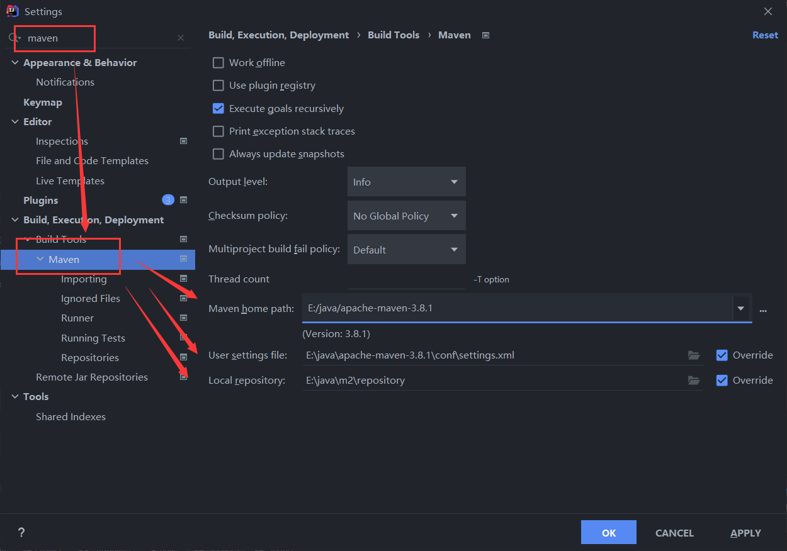
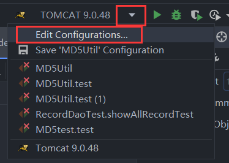
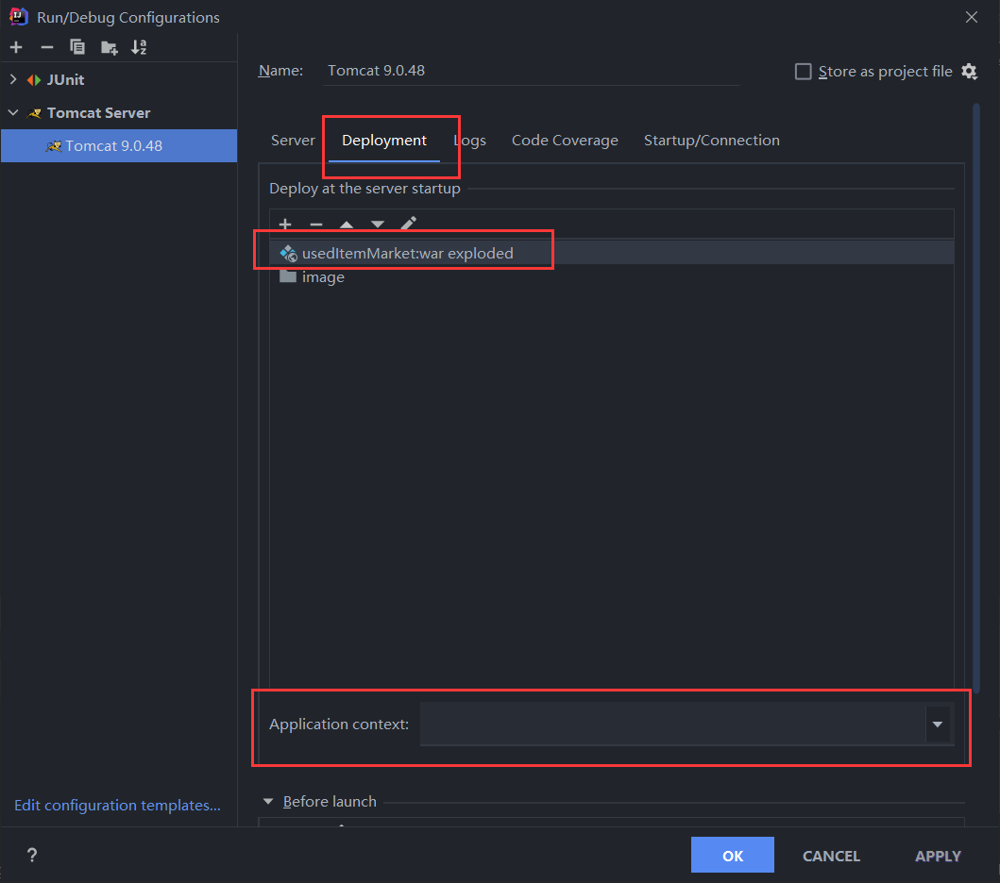
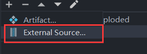
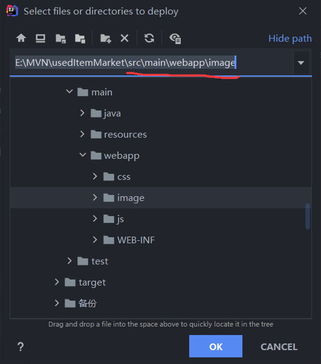
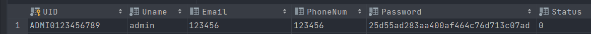
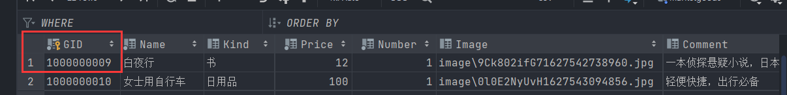
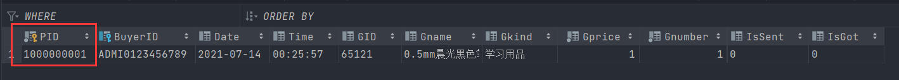

1.  请保证运行电脑已安装环境不低于以下要求：

    MySQL 8.0.23

    Tomcat 9.0.48（注意，不可使用Tomcat 10或以上版本）

    Windows 10操作系统

    Maven-3.8.1

    一个能正常使用tomcat、maven及编译java的编译器（idea或VS code皆可）

1.  请保证已建立和此项目相同的数据库（包括数据库名、表名、属性名、完整性约束等）

2.  导入项目或打开项目后，如果maven的配置文件和库目录为自定义路径，请将maven配置改为运行所用电脑的配置

    

    并且在修改完毕后，右键pom.xml重建加载项目（Reload Project）

3.  启动tomcat前，请将Tomcat做出如下配置

    

    添加主项目，并将Application Context栏置空

    

    添加External Source，将src/main/webapp/image文件夹添加至tomcat的部署中

    

    

4.  因管理员账户无法注册，如果需要管理员账号，请手动在user表中添加管理员信息，如：

1.  请手动在marketgoods和tracerecord表中添加一条首数据，用来指定起始主键，之后各种操作会自动添加主键，如：

Marketgoods表

>   

>   Tracerecord表：

>   
