## 系统设计

1、登录注册

（1）管理员的账号和密码是内定的，在数据库中直接添加、修改和删除，无需注册，如图1-1-1所示。登录实现逻辑和用户登录大同小异。仅有登录成功和失败两种情况，失败会留在原登录界面并收到相应的错误信息；成功将保存管理员登录信息，并跳转到管理员的操作界面。

图1-1-1 登录失败页面

1.  用户登录：用户点击登录按钮后，向服务端发送post请求。结果包含以下几种情况：①用户名或密码为空；②用户名或密码错误；③用户被管理员注销；④用户密码被管理员重置为默认密码，需要紧急修改密码；⑤登录成功，用户提供的用户名和密码和数据库中的相符。前三种情况只需在model中添加相应的信息，然后跳转回登录页面通过thymeleaf显示相应的错误信息。情况四将会跳转到密码修改界面，让用户设置密码，此时用户除了修改密码无任何权限，如图1-2-1所示。情况五将登录的用户信息存到model中然后发送给首页，显示相应的前端用户信息。如图1-2-2所示。

图1-2-2 用户登录核心代码

（3）用户注册：如图1-3-1所示，用户注册时有以下内容。我们将所有的文本框都绑定了事件，以在前端动态实时显示相应的要求（比如学号长度不正确，密码长度过短、邮箱格式不正确等问题）。但是学号的unique性必须把信息发送到后端中，判断学号是否唯一。如果各项要求都满足的话，数据库中添加用户信息于User（用户）表中，注册成功，直接登录，用户跳转到首页。

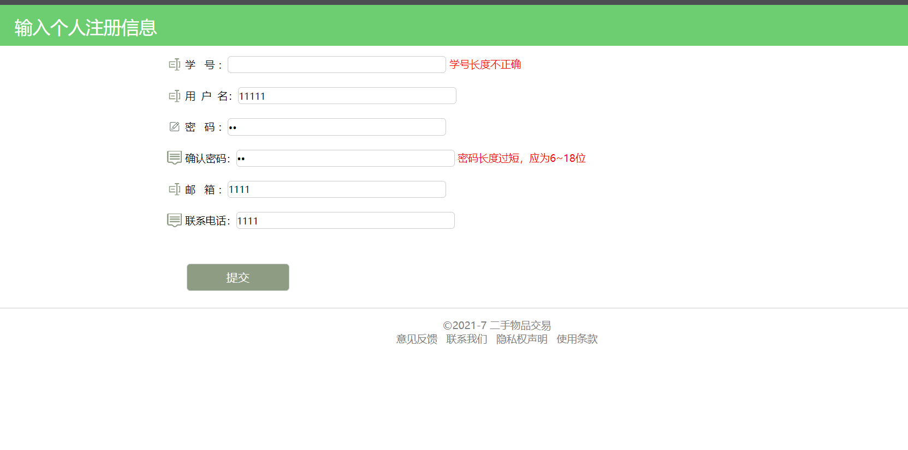

图1-3-1 注册界面

1.  管理员管理用户

管理员登录成功后，可以跳转到管理用户的页面上，从数据库的User表和交易记录表中获取所有用户的信息（为了用户的个人安全，信息中不包括可见明码）和交易记录，如图2-0-1所示。

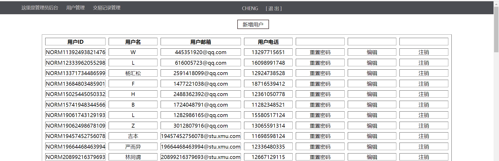

图2-0-1 管理员管理界面

1.  更改用户信息（其中密码只可重置不可随意修改）：管理员可以直接操作数据库User表中用户的信息，如邮箱、电话等等。其中用户的密码一旦被重置后，服务端将会发送一封邮件到用户的预存邮箱当中，并告知其密码已被重置为xxx，为了保证账号的安全，请尽快到个人中心修改密码，如图2-1-1所示。

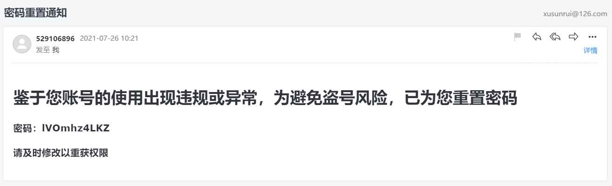

图2-1-1 邮箱通知

（2）注销用户：管理员可以将一些用户注销，被注销的用户将会失去所有权限，但是其个人信息仍在数据库中保留，用户Status会被置为2，如图2-2-1中用户小一即被注销，其发布要售卖的商品标为0，不在页面展示。

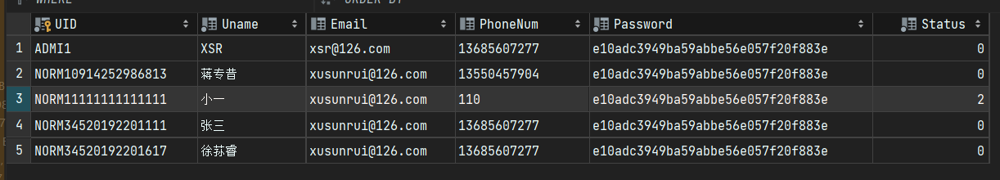

图2-2-1 注销后的用户中数据库信息

（3）新增用户（密码为默认密码）：管理员可以新增用户，其逻辑和用户手动注册大同小异，如图2-3-1所示。

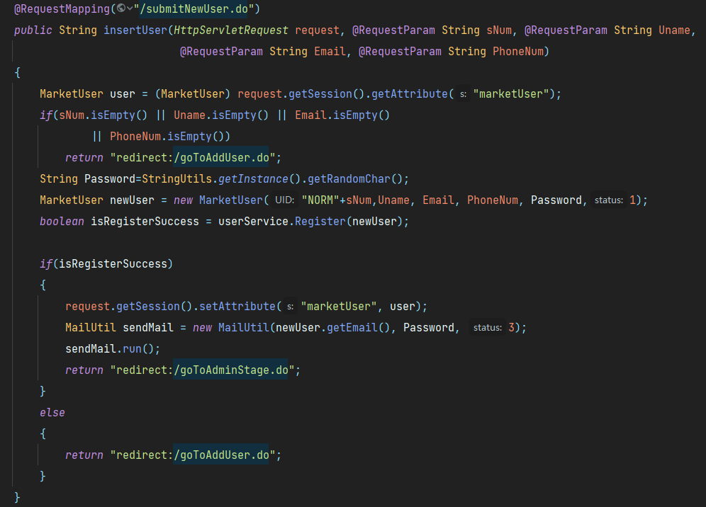

图2-3-1 新增用户核心代码

1.  查看买卖信息：管理员可以查看所有用户的买卖记录，从交易记录表中获取，如图2-4-1所示。

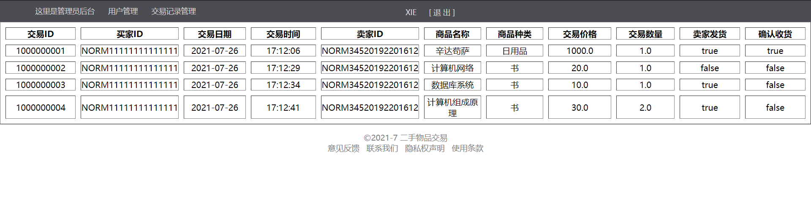

图2-4-1 管理员查看所有用户的买卖记录

1.  卖家发布商品：用户登录后可以看到自己售卖的商品的具体信息，并对其做出相应的修改（marketgoods表），还可以看到自己的商品被购买的记录（tradercord表），如图3-0-1、3-0-2所示。

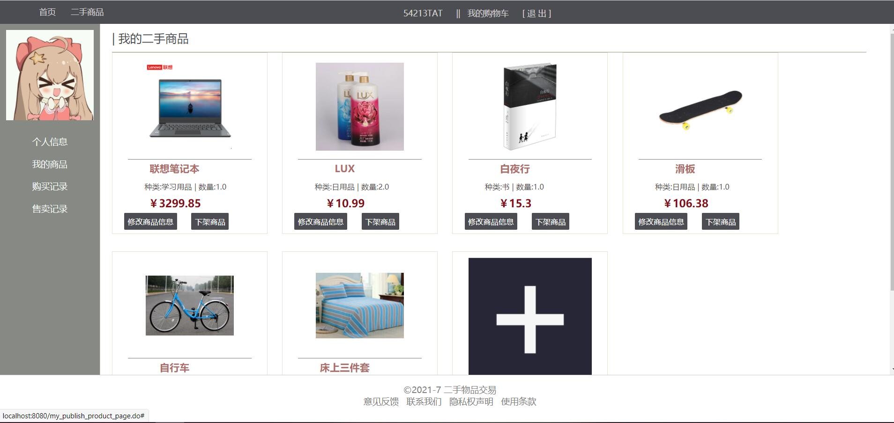

图3-0-1 用户售卖商品的详细信息及修改界面

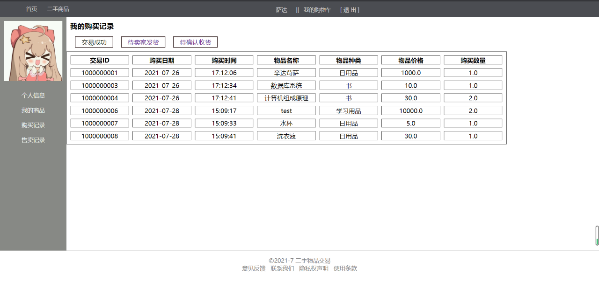

图3-0-2 用户交易记录

（1）下架商品（将商品数量置为0，保留在数据库中）：卖家将在售商品置为0，或者直接点击删除商品，说明该商品不再售卖，但是数据库中仍保留该商品，数量为0。此时在主页和搜索界面不能看到其商品。

（2）新增商品：卖家发布商品，传入商品图片、名称、数量、价格和描述的信息。如果满足要求则加入数据库的marketgoods（在售商品，表示售卖商品的详细信息）表和salesgoods（商品售卖、表示商品是哪个发布者发布的）表中，重新进入首页或搜索其商品可得到，如图3-2-1所示。

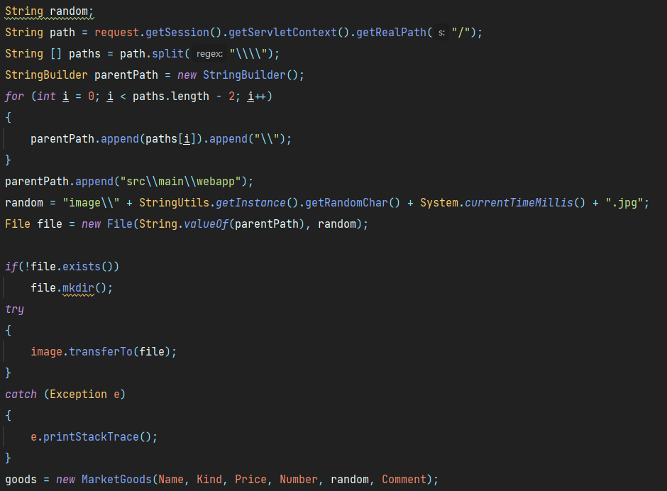

图3-2-1 新增商品时上传图片的核心代码

1.  修改商品信息：卖家在发布商品后可以修改商品的信息，比如更换图片，价格的修改，数量的修改（当数量降为0后自动默认删除商品）。修改后的信息发送到数据库marketgoods表中，如图3-3-1所示。

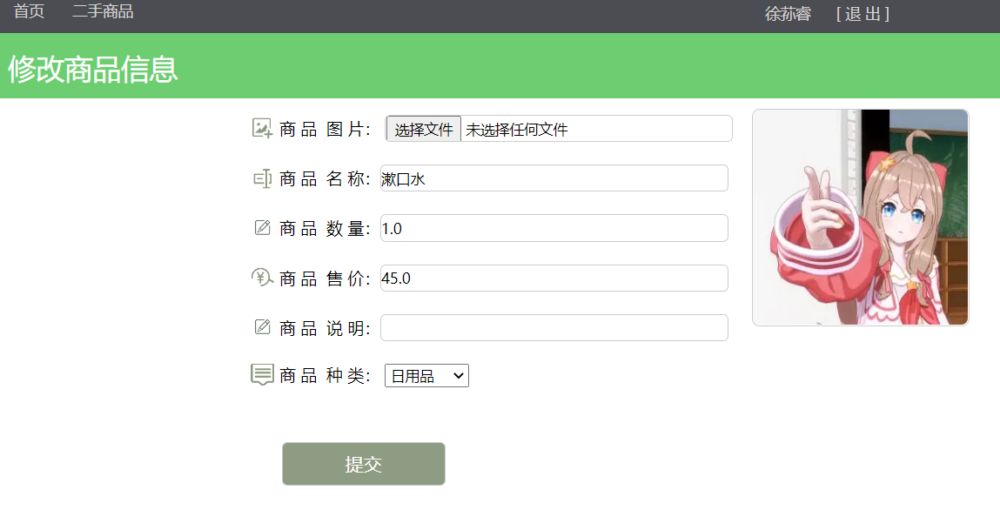

图3-3-1 修改商品信息界面

（5）确认发货：买家直接下单（通过购物车下单）后，卖家将会出现交易请求，卖家同意交易，则发货。

4、买家购买商品

（1）提供商品的查找、排序、分类功能：

默认情况下，一页可展示12个商品，默认按商品的GID排序，每次单击下一页或上一页按钮时，前端js发送当前页面的下（上）一页的页码值到后端，从数据库中动态获取12个商品（原理为limit
page \* 12,
12），返回一个goods的ArrayList集合，通过thymeleaf语法遍历集合动态生成相应的前端div元素如图4-1-1所示。

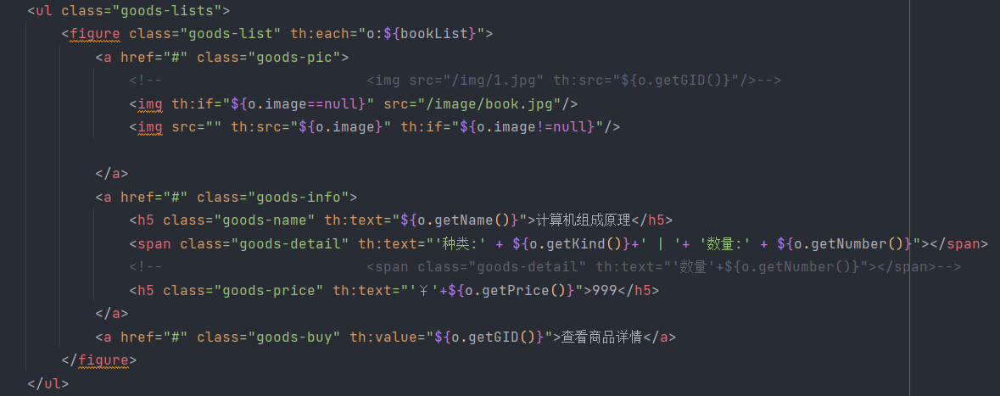

图4-1-1 实现前端页面的核心代码

用户可以在主页和搜索商品界面输入关键字，发送到数据库中进行模糊查询，如关键字“书”即在数据库中查询“%书%”，此时不加limit限制，获取所有的有关商品于一个集合中，如图4-1-2所示。

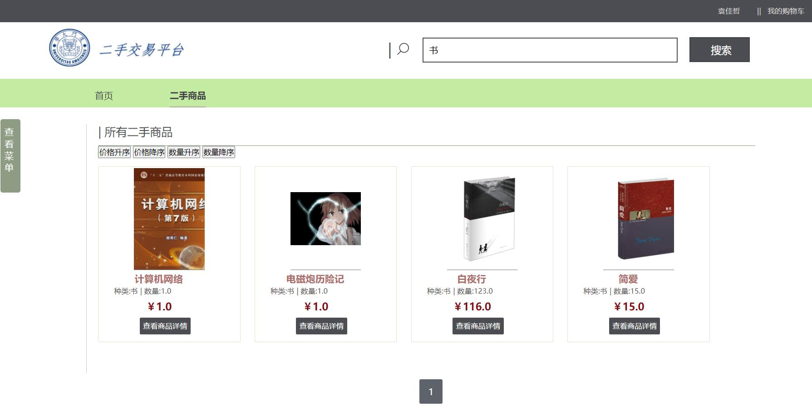

图4-1-2 搜索功能

我们还提供了商品的排序功能：按价格升（降）序，按库存升（降）序，如图4-1-3所示。无其他限制条件（按类别查找或模糊搜索）时，将会从数据库中直接取出某一页的商品，否则取出全部，排序后再返回某一页的商品。

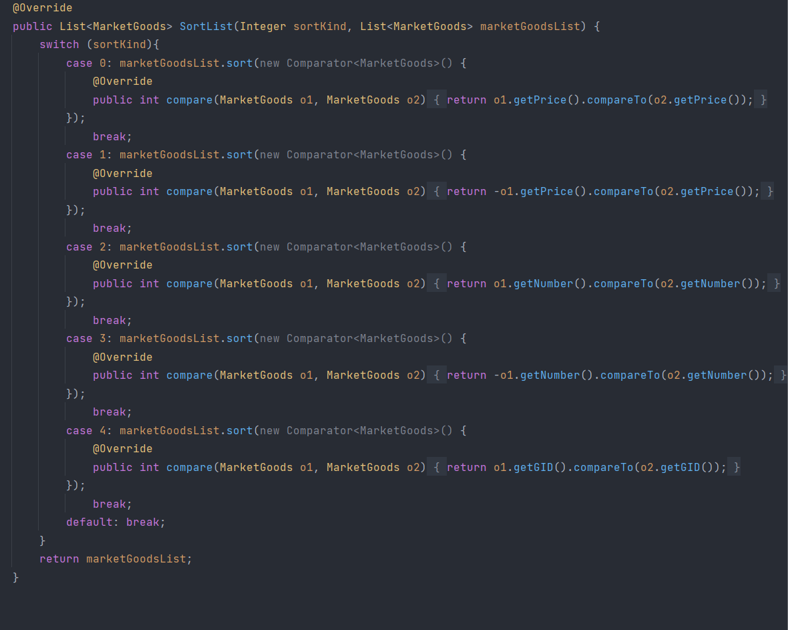

图4-1-3 排序功能的核心代码

我们还提供了分类功能，如图4-1-4所示：在前端页面上选择物品种类，发送到后端后，在数据库中查找物品种类相对应的商品返回到前端页面，实现同上述几种情况类似。

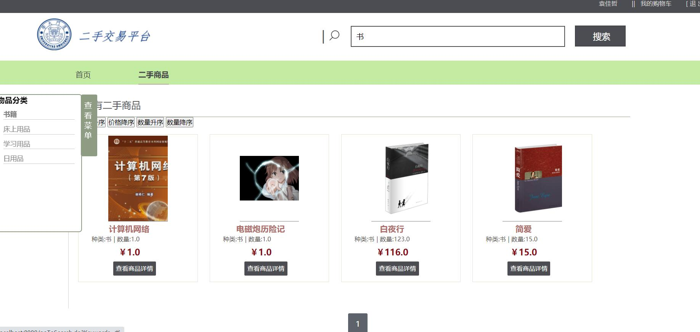

图4-1-4 分类功能

（2）添加到购物车后可以修改商品数量，或删除商品（将商品数量置0），在购物车中下单：用户在浏览商品的时候可以将商品添加至购物车，之前会通过判断商品的UID和当前用户的UID是否相同来判断这件商品是否为用户自己的，若是自己的则无法添加至购物车并通告错误信息；不是自己的情况下可以添加至购物车，此时不能修改件数，只能在购物车中修改；修改的数量不能超过商城页面的物品数量，否则会报出错误信息。添加成功后，前端会发送添加商品的信息至后端，经处理后写入数据库的ShoppingCart（购物车）表中。

1.  直接购买下单：用户可以直接在商城界面下单，无需添加到购物车。在用户打开商品详细信息后，可以看到商品单价，商品描述，还有卖家的一些信息，如图4-3-1所示。下单前也会判断商品是否为用户本人自己的。下单后其相应的商品数量会在商城（marketgoods表）减少，在数据库的traderecord表中添加一条新记录，这条记录从卖家发货前到买家收货后一直存在，详见下文个人信息中的查看买卖记录。

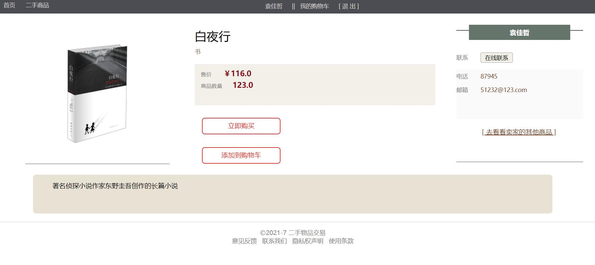

图4-3-1 商品详细信息

（4）确认收货：卖家发货后，买家交易记录将会变成待确认收货状态，当买家受到货后点击确认收获，交易完成。

5、个人信息

在个人信息界面可以看到或修改用户的一些个人信息：如电话号，头像等。还可以看到自己的交易记录，还有自己发布的商品信息，如图5-0-1所示

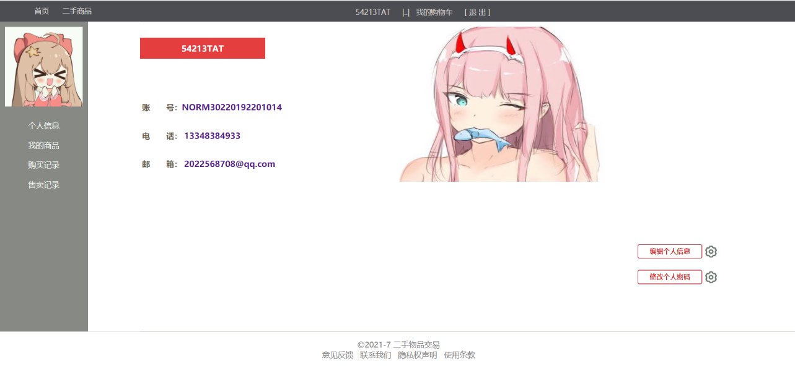

图5-0-1 个人信息界面

1.  查看买卖记录：在买家成功下单后会有三种状态：第一种状态为待发货（IsSent为0，IsGot为0），第二种状态为待收货（IsSent为1，IsGot为0），第三种状态为交易完成（IsSent为1，IsGot为1）。三种状态对应数据库的两个属性，如图5-1-1所示。在三种状态下，前端页面也会相应地显示三种记录，比如卖家已发货但买家未收货时，卖家的待买家收货记录中将会出现该条记录，买家的待卖家发货记录中会删除该条记录。

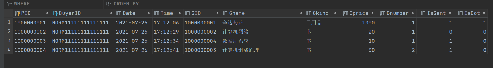

图5-1-1 数据库中的两个属性的对应的三种状态

1.  修改个人信息：用户可以修改自己的信息，如电话号码的修改，头像的更换等。相应地在数据库User表中也会对其信息进行修改，其实现逻辑和用户注册相似，如图5-2-1所示。

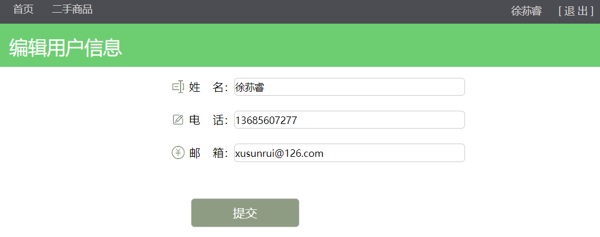

图 5-2-1 修改用户个人信息

1.  查看售卖商品：用户可以在个人信息界面查看自己的在售商品并对其信息进行修改，如图5-3-1所示，至于修改发布商品的详细描述请参见第三节“卖家发布商品”。

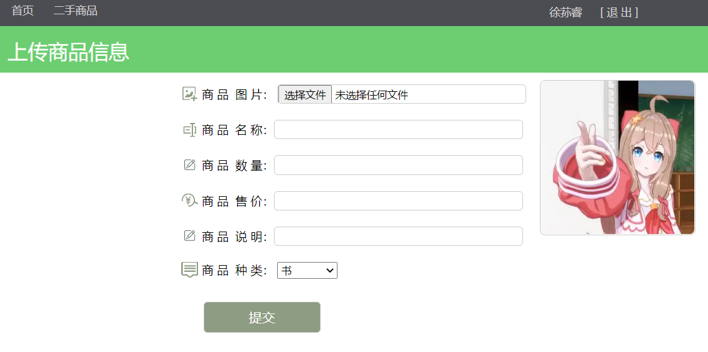

图5-3-1 卖家查看已发布商品页面

6、拓展功能

（1）密码加密：该网页下所有的用户密码均经过MD5加密，即仅能单向加密后不能反向破译，保护用户信息安全，其实现原理如图6-1-1所示：

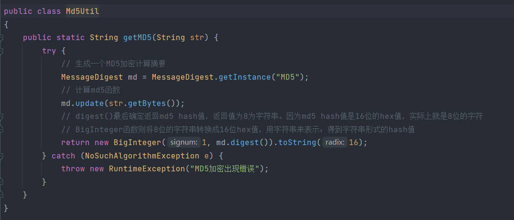

图6-1-1 MD5加密的核心代码

## 数据库建表：

（无需外键约束）

表1 User（用户）表

| 字段名称 | 数据类型 | 数据大小 | 存储信息 |
|----------|----------|----------|----------|
| UID      | Char     | 18       | 用户主码 |
| Uname    | Varchar  | 30       | 用户姓名 |
| Email    | Varchar  | 50       | 用户邮箱 |
| PhoneNum | Char     | 11       | 用户电话 |
| Password | Varchar  | 16       | 用户密码 |
| Status   | Int      |          | 用户状态 |

表2 traderecord（交易记录）表

| 字段名称 | 数据类型 | 数据大小 | 存储信息   |
|----------|----------|----------|------------|
| PID      | Varchar  | 10       | 记录主码   |
| BuyerID  | Char     | 18       | 购买者主码 |
| Date     | date     |          | 购买日期   |
| Time     | time     |          | 购买时间   |
| GID      | Varchar  | 10       | 商品主码   |
| Gname    | Varchar  | 255      | 商品名称   |
| Gkind    | Varchar  | 30       | 商品种类   |

表2（续）

| 字段名称 | 数据类型 | 数据大小 | 存储信息 |
|----------|----------|----------|----------|
| Gprice   | Double   | 10       | 商品单价 |
| Gnumber  | Int      |          | 商品库存 |
| IsSent   | Boolean  |          | 是否发货 |
| IsGot    | Boolean  |          | 是否收货 |

表3 MarketGoods（商品信息）表

| 字段名称 | 数据类型 | 数据大小 | 存储信息 |
|----------|----------|----------|----------|
| GID      | Varchar  | 10       | 商品主码 |
| Name     | Varchar  | 255      | 商品名称 |
| Kind     | Varchar  | 30       | 商品种类 |
| Price    | Double   | 10       | 商品单价 |
| Number   | Int      |          | 商品库存 |
| Image    | Varchar  | 500      | 图片路径 |
| Comment  | Varchar  | 500      | 商品简介 |

表4 SaleGoods（商品归属）表

| 字段名称 | 数据类型 | 数据大小 | 存储信息 |
|----------|----------|----------|----------|
| UID      | Char     | 18       | 用户主码 |
| GID      | Varchar  | 10       | 商品主码 |

表5 ShoppingCart（购物车）表

| 字段名称 | 数据类型 | 数据大小 | 存储信息 |
|----------|----------|----------|----------|
| UID      | Char     | 18       | 用户主码 |
| GID      | Varchar  | 10       | 商品主码 |
| Number   | Int      |          | 添加数量 |
